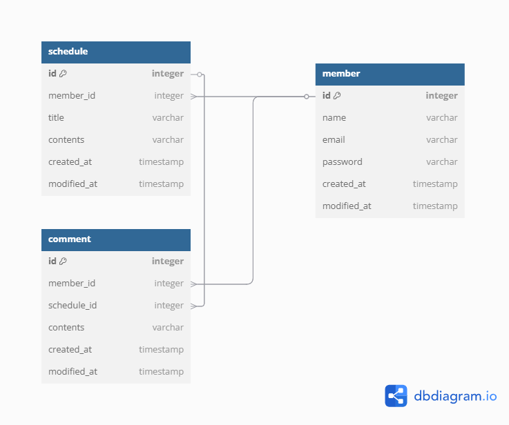

# 📌 일정 관리 앱 API

**Schedule Management Application API**

일정을 관리할 수 있는 애플리케이션의 API 입니다.

## 프로젝트 개요

- 유저 및 로그인
  - 유저 정보를 등록 및 조회할 수 있습니다.
  - 등록한 유저의 이메일과 비밀번호를 사용하여 로그인, 로그아웃이 가능합니다.
  - 로그인 성공 시 응답 헤더에 세션 ID가 첨부되어 전달됩니다.
  - 로그인 세션이 없는 상태에서 회원가입, 로그인, 로그아웃 외의 API 요청 시 거부됩니다.
- 일정
  - 일정을 등록, 조회, 수정, 삭제를 할 수 있습니다. 
  - 작성자명, 댓글 개수 등을 포함한 일정 리스트를 조회할 수 있습니다.
  - 일정 단일 조회 시 댓글 리스트를 함께 전달 받습니다.
  - 일정의 수정, 삭제 시에는 해당 일정을 작성했던 유저 정보로 로그인 한 상태에서만 가능합니다.
- 댓글
  - 댓글을 등록, 조회, 수정, 삭제를 할 수 있습니다.
  - 특정 일정에 달린 댓글들을 조회할 수 있습니다.
  - 댓글의 수정, 삭제 시에는 해당 댓글을 작성했던 유저 정보로 로그인 한 상태에서만 가능합니다.

## 개발 환경

- 
- 
- 
- 

## 실행 방법

```bash
git clone https://github.com/NCookies/schedule-management-enhanced-api.git

cd schedule-management-enhanced-api

# MySQL 컨테이너를 백그라운드로 실행 (초기화 SQL 함께 실행)
docker-compose up -d

# 프로젝트 빌드 (의존성 다운로드 및 컴파일)
./gradlew build

# 스프링 부트 애플리케이션 실행
./gradlew bootRun

# docker 컨테이너 정지 및 데이터 볼륨까지 삭제
docker-compose down -v
```

## 관련 문서

### ERD



### 트러블 슈팅

- [[내일배움캠프] 일정 관리 API 프로젝트(숙련) 트러블 슈팅](https://velog.io/@ncookie/%EB%82%B4%EC%9D%BC%EB%B0%B0%EC%9B%80%EC%BA%A0%ED%94%84-%EC%9D%BC%EC%A0%95-%EA%B4%80%EB%A6%AC-API-%ED%94%84%EB%A1%9C%EC%A0%9D%ED%8A%B8%EC%88%99%EB%A0%A8-%ED%8A%B8%EB%9F%AC%EB%B8%94-%EC%8A%88%ED%8C%85)

### Postman document
  - [포스트맨 문서 링크](https://documenter.getpostman.com/view/27399553/2sB2cSfNor)
  - 포스트맨을 활용해 API 명세서를 작성했다. 요청 데이터에 따른 여러 응답을 확인해볼 수 있다.

### API Table

- [원본 구글 시트](https://docs.google.com/spreadsheets/d/1UaTSII0Gmnf4ftC8MFRddjnuN4dZI3Ib8ISVyGxiXIk/edit?usp=sharing)
- [변환 사이트](https://wikidocs.net/267365)

#### Auth

| Method   | Endpoint                                         | Description | Parameters                               | Request Body                                                                         | Response                                                                                                                                                                                                                                                                                                                                                                                                                                                                                                                                                                                                                                                                                                                                                                                                                                                                                                                                                                                                                                                                                                                                                                                                                                                                                                                                                                                                                                                                                                                                                                                                                                                                                                                                                                                                                                                                                                                                                                                                                                                                                                                                                                                                                                                                                                                                                                                                                                                                                                                                                                                                                                                                                                                                                                                                                                                                                                                                                                                                                                                                                                                                                                                                                                                                                                                                                                                                                                                                                                                                                                                                                                                                                                                                                                                                                                                                                                                                                                                                                                                                                                              | Status Code |
| -------- | ------------------------------------------------ | ----------- | ---------------------------------------- | ------------------------------------------------------------------------------------ | --------------------------------------------------------------------------------------------------------------------------------------------------------------------------------------------------------------------------------------------------------------------------------------------------------------------------------------------------------------------------------------------------------------------------------------------------------------------------------------------------------------------------------------------------------------------------------------------------------------------------------------------------------------------------------------------------------------------------------------------------------------------------------------------------------------------------------------------------------------------------------------------------------------------------------------------------------------------------------------------------------------------------------------------------------------------------------------------------------------------------------------------------------------------------------------------------------------------------------------------------------------------------------------------------------------------------------------------------------------------------------------------------------------------------------------------------------------------------------------------------------------------------------------------------------------------------------------------------------------------------------------------------------------------------------------------------------------------------------------------------------------------------------------------------------------------------------------------------------------------------------------------------------------------------------------------------------------------------------------------------------------------------------------------------------------------------------------------------------------------------------------------------------------------------------------------------------------------------------------------------------------------------------------------------------------------------------------------------------------------------------------------------------------------------------------------------------------------------------------------------------------------------------------------------------------------------------------------------------------------------------------------------------------------------------------------------------------------------------------------------------------------------------------------------------------------------------------------------------------------------------------------------------------------------------------------------------------------------------------------------------------------------------------------------------------------------------------------------------------------------------------------------------------------------------------------------------------------------------------------------------------------------------------------------------------------------------------------------------------------------------------------------------------------------------------------------------------------------------------------------------------------------------------------------------------------------------------------------------------------------------------------------------------------------------------------------------------------------------------------------------------------------------------------------------------------------------------------------------------------------------------------------------------------------------------------------------------------------------------------------------------------------------------------------------------------------------------------------------------------- | ----------- |
| POST     | /api/auth/login                                  | 로그인         |                                          | { 	"email" : "test1@email.com",     "password" : "Abcde123!!" }                      |                                                                                                                                                                                                                                                                                                                                                                                                                                                                                                                                                                                                                                                                                                                                                                                                                                                                                                                                                                                                                                                                                                                                                                                                                                                                                                                                                                                                                                                                                                                                                                                                                                                                                                                                                                                                                                                                                                                                                                                                                                                                                                                                                                                                                                                                                                                                                                                                                                                                                                                                                                                                                                                                                                                                                                                                                                                                                                                                                                                                                                                                                                                                                                                                                                                                                                                                                                                                                                                                                                                                                                                                                                                                                                                                                                                                                                                                                                                                                                                                                                                                                                                       | 200         |
| POST     | /api/auth/logout                                 | 로그아웃        |                                          |                                                                                      |                                                                                                                                                                                                                                                                                                                                                                                                                                                                                                                                                                                                                                                                                                                                                                                                                                                                                                                                                                                                                                                                                                                                                                                                                                                                                                                                                                                                                                                                                                                                                                                                                                                                                                                                                                                                                                                                                                                                                                                                                                                                                                                                                                                                                                                                                                                                                                                                                                                                                                                                                                                                                                                                                                                                                                                                                                                                                                                                                                                                                                                                                                                                                                                                                                                                                                                                                                                                                                                                                                                                                                                                                                                                                                                                                                                                                                                                                                                                                                                                                                                                                                                       |             |

#### Member

| Method   | Endpoint                                         | Description | Parameters                               | Request Body                                                                         | Response                                                                                                                                                                                                                                                                                                                                                                                                                                                                                                                                                                                                                                                                                                                                                                                                                                                                                                                                                                                                                                                                                                                                                                                                                                                                                                                                                                                                                                                                                                                                                                                                                                                                                                                                                                                                                                                                                                                                                                                                                                                                                                                                                                                                                                                                                                                                                                                                                                                                                                                                                                                                                                                                                                                                                                                                                                                                                                                                                                                                                                                                                                                                                                                                                                                                                                                                                                                                                                                                                                                                                                                                                                                                                                                                                                                                                                                                                                                                                                                                                                                                                                              | Status Code |
|----------| ------------------------------------------------ | ----------- | ---------------------------------------- | ------------------------------------------------------------------------------------ | --------------------------------------------------------------------------------------------------------------------------------------------------------------------------------------------------------------------------------------------------------------------------------------------------------------------------------------------------------------------------------------------------------------------------------------------------------------------------------------------------------------------------------------------------------------------------------------------------------------------------------------------------------------------------------------------------------------------------------------------------------------------------------------------------------------------------------------------------------------------------------------------------------------------------------------------------------------------------------------------------------------------------------------------------------------------------------------------------------------------------------------------------------------------------------------------------------------------------------------------------------------------------------------------------------------------------------------------------------------------------------------------------------------------------------------------------------------------------------------------------------------------------------------------------------------------------------------------------------------------------------------------------------------------------------------------------------------------------------------------------------------------------------------------------------------------------------------------------------------------------------------------------------------------------------------------------------------------------------------------------------------------------------------------------------------------------------------------------------------------------------------------------------------------------------------------------------------------------------------------------------------------------------------------------------------------------------------------------------------------------------------------------------------------------------------------------------------------------------------------------------------------------------------------------------------------------------------------------------------------------------------------------------------------------------------------------------------------------------------------------------------------------------------------------------------------------------------------------------------------------------------------------------------------------------------------------------------------------------------------------------------------------------------------------------------------------------------------------------------------------------------------------------------------------------------------------------------------------------------------------------------------------------------------------------------------------------------------------------------------------------------------------------------------------------------------------------------------------------------------------------------------------------------------------------------------------------------------------------------------------------------------------------------------------------------------------------------------------------------------------------------------------------------------------------------------------------------------------------------------------------------------------------------------------------------------------------------------------------------------------------------------------------------------------------------------------------------------------------------------- | ----------- |
| POST     | /api/members/register                            | 회원 가입       |                                          | {     "name" : "회원이름1", 	"email" : "test1@email.com",     "password" : "Abcde123!" } | {     "id": 1,     "name": "회원이름1",     "email": "test1@email.com",     "createdAt": "2025-04-01 19:23:20",     "modifiedAt": "2025-04-01 19:23:20" }                                                                                                                                                                                                                                                                                                                                                                                                                                                                                                                                                                                                                                                                                                                                                                                                                                                                                                                                                                                                                                                                                                                                                                                                                                                                                                                                                                                                                                                                                                                                                                                                                                                                                                                                                                                                                                                                                                                                                                                                                                                                                                                                                                                                                                                                                                                                                                                                                                                                                                                                                                                                                                                                                                                                                                                                                                                                                                                                                                                                                                                                                                                                                                                                                                                                                                                                                                                                                                                                                                                                                                                                                                                                                                                                                                                                                                                                                                                                                                 | 201         |
| GET      | /api/members/me                                  | 내 정보 조회     |                                          |                                                                                      | {     "id": 1,     "name": "회원이름1",     "email": "test1@email.com",     "createdAt": "2025-04-01 19:23:20",     "modifiedAt": "2025-04-01 19:23:20" }                                                                                                                                                                                                                                                                                                                                                                                                                                                                                                                                                                                                                                                                                                                                                                                                                                                                                                                                                                                                                                                                                                                                                                                                                                                                                                                                                                                                                                                                                                                                                                                                                                                                                                                                                                                                                                                                                                                                                                                                                                                                                                                                                                                                                                                                                                                                                                                                                                                                                                                                                                                                                                                                                                                                                                                                                                                                                                                                                                                                                                                                                                                                                                                                                                                                                                                                                                                                                                                                                                                                                                                                                                                                                                                                                                                                                                                                                                                                                                 | 200         |
| GET      | /api/members/{id}                                | 다른 회원 정보 조회 | Path: - id                               |                                                                                      | {     "id": 1,     "name": "회원이름1",     "email": "test1@email.com",     "createdAt": "2025-04-02 01:36:39",     "modifiedAt": "2025-04-02 01:36:39" }                                                                                                                                                                                                                                                                                                                                                                                                                                                                                                                                                                                                                                                                                                                                                                                                                                                                                                                                                                                                                                                                                                                                                                                                                                                                                                                                                                                                                                                                                                                                                                                                                                                                                                                                                                                                                                                                                                                                                                                                                                                                                                                                                                                                                                                                                                                                                                                                                                                                                                                                                                                                                                                                                                                                                                                                                                                                                                                                                                                                                                                                                                                                                                                                                                                                                                                                                                                                                                                                                                                                                                                                                                                                                                                                                                                                                                                                                                                                                                 | 200         |
| PUT      | /api/members/me/info                             | 회원 정보 수정    |                                          | {     "name" : "회원이름 수정" }                                                           | {     "id": 1,     "name": "회원이름 수정",     "email": "test1@email.com",     "createdAt": "2025-04-02 01:36:39",     "modifiedAt": "2025-04-02 17:18:49" }                                                                                                                                                                                                                                                                                                                                                                                                                                                                                                                                                                                                                                                                                                                                                                                                                                                                                                                                                                                                                                                                                                                                                                                                                                                                                                                                                                                                                                                                                                                                                                                                                                                                                                                                                                                                                                                                                                                                                                                                                                                                                                                                                                                                                                                                                                                                                                                                                                                                                                                                                                                                                                                                                                                                                                                                                                                                                                                                                                                                                                                                                                                                                                                                                                                                                                                                                                                                                                                                                                                                                                                                                                                                                                                                                                                                                                                                                                                                                               | 200         |
| PUT      | /api/members/me/password                         | 회원 비밀번호 수정  |                                          | {     "oldPassword" : "Abcde123!",     "newPassword" : "Abcde123!!" }                | {     "id": 1,     "name": "회원이름1",     "email": "test1@email.com",     "createdAt": "2025-04-02 01:36:39",     "modifiedAt": "2025-04-02 01:36:39" }                                                                                                                                                                                                                                                                                                                                                                                                                                                                                                                                                                                                                                                                                                                                                                                                                                                                                                                                                                                                                                                                                                                                                                                                                                                                                                                                                                                                                                                                                                                                                                                                                                                                                                                                                                                                                                                                                                                                                                                                                                                                                                                                                                                                                                                                                                                                                                                                                                                                                                                                                                                                                                                                                                                                                                                                                                                                                                                                                                                                                                                                                                                                                                                                                                                                                                                                                                                                                                                                                                                                                                                                                                                                                                                                                                                                                                                                                                                                                                 | 200         |
| DEL      | /api/members/me                                  | 회원 탈퇴       |                                          |                                                                                      |                                                                                                                                                                                                                                                                                                                                                                                                                                                                                                                                                                                                                                                                                                                                                                                                                                                                                                                                                                                                                                                                                                                                                                                                                                                                                                                                                                                                                                                                                                                                                                                                                                                                                                                                                                                                                                                                                                                                                                                                                                                                                                                                                                                                                                                                                                                                                                                                                                                                                                                                                                                                                                                                                                                                                                                                                                                                                                                                                                                                                                                                                                                                                                                                                                                                                                                                                                                                                                                                                                                                                                                                                                                                                                                                                                                                                                                                                                                                                                                                                                                                                                                       | 200         |

#### Schedule

| Method   | Endpoint                                         | Description | Parameters                               | Request Body                                                                         | Response                                                                                                                                                                                                                                                                                                                                                                                                                                                                                                                                                                                                                                                                                                                                                                                                                                                                                                                                                                                                                                                                                                                                                                                                                                                                                                                                                                                                                                                                                                                                                                                                                                                                                                                                                                                                                                                                                                                                                                                                                                                                                                                                                                                                                                                                                                                                                                                                                                                                                                                                                                                                                                                                                                                                                                                                                                                                                                                                                                                                                                                                                                                                                                                                                                                                                                                                                                                                                                                                                                                                                                                                                                                                                                                                                                                                                                                                                                                                                                                                                                                                                                              | Status Code |
|----------| ------------------------------------------------ | ----------- | ---------------------------------------- | ------------------------------------------------------------------------------------ | --------------------------------------------------------------------------------------------------------------------------------------------------------------------------------------------------------------------------------------------------------------------------------------------------------------------------------------------------------------------------------------------------------------------------------------------------------------------------------------------------------------------------------------------------------------------------------------------------------------------------------------------------------------------------------------------------------------------------------------------------------------------------------------------------------------------------------------------------------------------------------------------------------------------------------------------------------------------------------------------------------------------------------------------------------------------------------------------------------------------------------------------------------------------------------------------------------------------------------------------------------------------------------------------------------------------------------------------------------------------------------------------------------------------------------------------------------------------------------------------------------------------------------------------------------------------------------------------------------------------------------------------------------------------------------------------------------------------------------------------------------------------------------------------------------------------------------------------------------------------------------------------------------------------------------------------------------------------------------------------------------------------------------------------------------------------------------------------------------------------------------------------------------------------------------------------------------------------------------------------------------------------------------------------------------------------------------------------------------------------------------------------------------------------------------------------------------------------------------------------------------------------------------------------------------------------------------------------------------------------------------------------------------------------------------------------------------------------------------------------------------------------------------------------------------------------------------------------------------------------------------------------------------------------------------------------------------------------------------------------------------------------------------------------------------------------------------------------------------------------------------------------------------------------------------------------------------------------------------------------------------------------------------------------------------------------------------------------------------------------------------------------------------------------------------------------------------------------------------------------------------------------------------------------------------------------------------------------------------------------------------------------------------------------------------------------------------------------------------------------------------------------------------------------------------------------------------------------------------------------------------------------------------------------------------------------------------------------------------------------------------------------------------------------------------------------------------------------------------------------- | ----------- |
| POST     | /api/schedules                                   | 일정 생성       |                                          | { 	"title" : "할 일",     "contents" : "contenst test" }                               |                                                                                                                                                                                                                                                                                                                                                                                                                                                                                                                                                                                                                                                                                                                                                                                                                                                                                                                                                                                                                                                                                                                                                                                                                                                                                                                                                                                                                                                                                                                                                                                                                                                                                                                                                                                                                                                                                                                                                                                                                                                                                                                                                                                                                                                                                                                                                                                                                                                                                                                                                                                                                                                                                                                                                                                                                                                                                                                                                                                                                                                                                                                                                                                                                                                                                                                                                                                                                                                                                                                                                                                                                                                                                                                                                                                                                                                                                                                                                                                                                                                                                                                       | 201         |
| GET      | /api/schedules                                   | 일정 단일 조회    | Path: - id                               |                                                                                      | {     "id": 1,     "title": "할 일",     "contents": "update test",     "memberSummaryDto": {         "id": 1,         "name": "회원이름 수정"     },     "comments": {         "content": [             {                 "id": 5,                 "contents": "comment test",                 "memberSummaryDto": {                     "id": 1,                     "name": "회원이름 수정"                 },                 "scheduleId": 1,                 "createdAt": "2025-04-02 17:19:48",                 "modifiedAt": "2025-04-02 17:19:48"             },             {                 "id": 4,                 "contents": "comment test",                 "memberSummaryDto": {                     "id": 1,                     "name": "회원이름 수정"                 },                 "scheduleId": 1,                 "createdAt": "2025-04-02 17:19:48",                 "modifiedAt": "2025-04-02 17:19:48"             },             {                 "id": 3,                 "contents": "comment test",                 "memberSummaryDto": {                     "id": 1,                     "name": "회원이름 수정"                 },                 "scheduleId": 1,                 "createdAt": "2025-04-02 17:19:46",                 "modifiedAt": "2025-04-02 17:19:46"             }         ],         "pageable": {             "pageNumber": 0,             "pageSize": 10,             "sort": {                 "empty": false,                 "sorted": true,                 "unsorted": false             },             "offset": 0,             "paged": true,             "unpaged": false         },         "last": true,         "totalElements": 3,         "totalPages": 1,         "first": true,         "size": 10,         "number": 0,         "sort": {             "empty": false,             "sorted": true,             "unsorted": false         },         "numberOfElements": 3,         "empty": false     },     "createdAt": "2025-04-02 01:36:42",     "modifiedAt": "2025-04-02 02:29:37" }                                                                                                                                                                                                                                                                                                                                                                                                                                                                                                                                                                                                                                                                                                                                                                                                                                                                                                                                                                                                                                                                                                                                                                                                                                                                                                                                                                                                                                                                                                                                                                                                                                                                                                                                                                                                                                                                                                                                                                                                                                                                    | 200         |
| GET      | /api/schedules                                   | 일정 전체 조회    | Query: - page - size                     |                                                                                      | {     "content": [         {             "id": 15,             "title": "할 일",             "contents": "contenst test",             "memberSummary": {                 "id": 1,                 "name": "회원이름1"             },             "commentCount": 0,             "createdAt": "2025-04-02 17:19:15",             "modifiedAt": "2025-04-02 17:19:15"         },         {             "id": 14,             "title": "할 일",             "contents": "contenst test",             "memberSummary": {                 "id": 1,                 "name": "회원이름1"             },             "commentCount": 0,             "createdAt": "2025-04-02 17:19:14",             "modifiedAt": "2025-04-02 17:19:14"         },         {             "id": 13,             "title": "할 일",             "contents": "contenst test",             "memberSummary": {                 "id": 1,                 "name": "회원이름1"             },             "commentCount": 0,             "createdAt": "2025-04-02 17:19:13",             "modifiedAt": "2025-04-02 17:19:13"         },         {             "id": 12,             "title": "할 일",             "contents": "contenst test",             "memberSummary": {                 "id": 1,                 "name": "회원이름1"             },             "commentCount": 0,             "createdAt": "2025-04-02 17:19:06",             "modifiedAt": "2025-04-02 17:19:06"         },         {             "id": 1,             "title": "할 일",             "contents": "update test",             "memberSummary": {                 "id": 1,                 "name": "회원이름1"             },             "commentCount": 1,             "createdAt": "2025-04-02 01:36:42",             "modifiedAt": "2025-04-02 02:29:37"         },         {             "id": 11,             "title": "할 일",             "contents": "contenst test",             "memberSummary": {                 "id": 1,                 "name": "회원이름1"             },             "commentCount": 0,             "createdAt": "2025-04-02 02:28:51",             "modifiedAt": "2025-04-02 02:28:51"         },         {             "id": 10,             "title": "할 일",             "contents": "contenst test",             "memberSummary": {                 "id": 1,                 "name": "회원이름1"             },             "commentCount": 0,             "createdAt": "2025-04-02 02:28:49",             "modifiedAt": "2025-04-02 02:28:49"         },         {             "id": 9,             "title": "할 일",             "contents": "contenst test",             "memberSummary": {                 "id": 1,                 "name": "회원이름1"             },             "commentCount": 0,             "createdAt": "2025-04-02 02:28:49",             "modifiedAt": "2025-04-02 02:28:49"         },         {             "id": 8,             "title": "할 일",             "contents": "contenst test",             "memberSummary": {                 "id": 1,                 "name": "회원이름1"             },             "commentCount": 0,             "createdAt": "2025-04-02 02:28:48",             "modifiedAt": "2025-04-02 02:28:48"         },         {             "id": 7,             "title": "할 일",             "contents": "contenst test",             "memberSummary": {                 "id": 1,                 "name": "회원이름1"             },             "commentCount": 0,             "createdAt": "2025-04-02 02:28:47",             "modifiedAt": "2025-04-02 02:28:47"         }     ],     "pageable": {         "pageNumber": 0,         "pageSize": 10,         "sort": {             "empty": false,             "sorted": true,             "unsorted": false         },         "offset": 0,         "paged": true,         "unpaged": false     },     "last": false,     "totalElements": 15,     "totalPages": 2,     "first": true,     "size": 10,     "number": 0,     "sort": {         "empty": false,         "sorted": true,         "unsorted": false     },     "numberOfElements": 10,     "empty": false } | 200         |
| PUT      | /api/schedules                                   | 일정 수정       | Path: - id                               | { 	"title" : "할 일",     "contents" : "update test" }                                 | {     "id": 2,     "memberSummaryDto": {         "id": 1,         "name": "회원이름1"     },     "title": "할 일",     "contents": "update test",     "createdAt": "2025-04-02 01:36:43",     "modifiedAt": "2025-04-02 01:36:43" }                                                                                                                                                                                                                                                                                                                                                                                                                                                                                                                                                                                                                                                                                                                                                                                                                                                                                                                                                                                                                                                                                                                                                                                                                                                                                                                                                                                                                                                                                                                                                                                                                                                                                                                                                                                                                                                                                                                                                                                                                                                                                                                                                                                                                                                                                                                                                                                                                                                                                                                                                                                                                                                                                                                                                                                                                                                                                                                                                                                                                                                                                                                                                                                                                                                                                                                                                                                                                                                                                                                                                                                                                                                                                                                                                                                                                                                                                         | 200         |
| DEL      | /api/schedules                                   | 일정 삭제       | Path: - id                               |                                                                                      |                                                                                                                                                                                                                                                                                                                                                                                                                                                                                                                                                                                                                                                                                                                                                                                                                                                                                                                                                                                                                                                                                                                                                                                                                                                                                                                                                                                                                                                                                                                                                                                                                                                                                                                                                                                                                                                                                                                                                                                                                                                                                                                                                                                                                                                                                                                                                                                                                                                                                                                                                                                                                                                                                                                                                                                                                                                                                                                                                                                                                                                                                                                                                                                                                                                                                                                                                                                                                                                                                                                                                                                                                                                                                                                                                                                                                                                                                                                                                                                                                                                                                                                       | 200         |

#### Comment

| Method   | Endpoint                                         | Description | Parameters                               | Request Body                                                                         | Response                                                                                                                                                                                                                                                                                                                                                                                                                                                                                                                                                                                                                                                                                                                                                                                                                                                                                                                                                                                                                                                                                                                                                                                                                                                                                                                                                                                                                                                                                                                                                                                                                                                                                                                                                                                                                                                                                                                                                                                                                                                                                                                                                                                                                                                                                                                                                                                                                                                                                                                                                                                                                                                                                                                                                                                                                                                                                                                                                                                                                                                                                                                                                                                                                                                                                                                                                                                                                                                                                                                                                                                                                                                                                                                                                                                                                                                                                                                                                                                                                                                                                                              | Status Code |
|----------| ------------------------------------------------ | ----------- | ---------------------------------------- | ------------------------------------------------------------------------------------ | --------------------------------------------------------------------------------------------------------------------------------------------------------------------------------------------------------------------------------------------------------------------------------------------------------------------------------------------------------------------------------------------------------------------------------------------------------------------------------------------------------------------------------------------------------------------------------------------------------------------------------------------------------------------------------------------------------------------------------------------------------------------------------------------------------------------------------------------------------------------------------------------------------------------------------------------------------------------------------------------------------------------------------------------------------------------------------------------------------------------------------------------------------------------------------------------------------------------------------------------------------------------------------------------------------------------------------------------------------------------------------------------------------------------------------------------------------------------------------------------------------------------------------------------------------------------------------------------------------------------------------------------------------------------------------------------------------------------------------------------------------------------------------------------------------------------------------------------------------------------------------------------------------------------------------------------------------------------------------------------------------------------------------------------------------------------------------------------------------------------------------------------------------------------------------------------------------------------------------------------------------------------------------------------------------------------------------------------------------------------------------------------------------------------------------------------------------------------------------------------------------------------------------------------------------------------------------------------------------------------------------------------------------------------------------------------------------------------------------------------------------------------------------------------------------------------------------------------------------------------------------------------------------------------------------------------------------------------------------------------------------------------------------------------------------------------------------------------------------------------------------------------------------------------------------------------------------------------------------------------------------------------------------------------------------------------------------------------------------------------------------------------------------------------------------------------------------------------------------------------------------------------------------------------------------------------------------------------------------------------------------------------------------------------------------------------------------------------------------------------------------------------------------------------------------------------------------------------------------------------------------------------------------------------------------------------------------------------------------------------------------------------------------------------------------------------------------------------------------------------- | ----------- |
| POST     | /api/schedules/{scheduleId}/comments             | 댓글 생성       | Path: - scheduleId                       | {     "contents" : "comment test" }                                                  | {     "id": 5,     "contents": "comment test",     "memberSummaryDto": {         "id": 1,         "name": "회원이름1"     },     "scheduleId": 1,     "createdAt": "2025-04-02 17:19:48",     "modifiedAt": "2025-04-02 17:19:48" }                                                                                                                                                                                                                                                                                                                                                                                                                                                                                                                                                                                                                                                                                                                                                                                                                                                                                                                                                                                                                                                                                                                                                                                                                                                                                                                                                                                                                                                                                                                                                                                                                                                                                                                                                                                                                                                                                                                                                                                                                                                                                                                                                                                                                                                                                                                                                                                                                                                                                                                                                                                                                                                                                                                                                                                                                                                                                                                                                                                                                                                                                                                                                                                                                                                                                                                                                                                                                                                                                                                                                                                                                                                                                                                                                                                                                                                                                       | 201         |
| GET      | /api/schedules/{scheduleId}/comments/{commentId} | 댓글 단일 조회    | Path: - scheduleId - commentId           |                                                                                      | {     "id": 2,     "contents": "comment test",     "memberSummaryDto": {         "id": 1,         "name": "회원이름1"     },     "scheduleId": 1,     "createdAt": "2025-04-02 02:13:21",     "modifiedAt": "2025-04-02 02:13:21" }                                                                                                                                                                                                                                                                                                                                                                                                                                                                                                                                                                                                                                                                                                                                                                                                                                                                                                                                                                                                                                                                                                                                                                                                                                                                                                                                                                                                                                                                                                                                                                                                                                                                                                                                                                                                                                                                                                                                                                                                                                                                                                                                                                                                                                                                                                                                                                                                                                                                                                                                                                                                                                                                                                                                                                                                                                                                                                                                                                                                                                                                                                                                                                                                                                                                                                                                                                                                                                                                                                                                                                                                                                                                                                                                                                                                                                                                                       | 200         |
| GET      | /api/schedules/{scheduleId}/comments             | 댓글 전체 조회    | Path: - scheduleId  Query: - page - size |                                                                                      | {     "content": [         {             "id": 5,             "contents": "comment test",             "memberSummaryDto": {                 "id": 1,                 "name": "회원이름1"             },             "scheduleId": 1,             "createdAt": "2025-04-02 17:19:48",             "modifiedAt": "2025-04-02 17:19:48"         },         {             "id": 4,             "contents": "comment test",             "memberSummaryDto": {                 "id": 1,                 "name": "회원이름1"             },             "scheduleId": 1,             "createdAt": "2025-04-02 17:19:48",             "modifiedAt": "2025-04-02 17:19:48"         },         {             "id": 3,             "contents": "comment test",             "memberSummaryDto": {                 "id": 1,                 "name": "회원이름1"             },             "scheduleId": 1,             "createdAt": "2025-04-02 17:19:46",             "modifiedAt": "2025-04-02 17:19:46"         },         {             "id": 2,             "contents": "comment test",             "memberSummaryDto": {                 "id": 1,                 "name": "회원이름1"             },             "scheduleId": 1,             "createdAt": "2025-04-02 02:13:21",             "modifiedAt": "2025-04-02 02:13:21"         }     ],     "pageable": {         "pageNumber": 0,         "pageSize": 10,         "sort": {             "empty": false,             "sorted": true,             "unsorted": false         },         "offset": 0,         "paged": true,         "unpaged": false     },     "last": true,     "totalElements": 4,     "totalPages": 1,     "first": true,     "size": 10,     "number": 0,     "sort": {         "empty": false,         "sorted": true,         "unsorted": false     },     "numberOfElements": 4,     "empty": false }                                                                                                                                                                                                                                                                                                                                                                                                                                                                                                                                                                                                                                                                                                                                                                                                                                                                                                                                                                                                                                                                                                                                                                                                                                                                                                                                                                                                                                                                                                                                                                                                                                                                                                                                                                                                                                                                                                                                                                                                                                                                                                                                                                                                                                                      | 200         |
| PUT      | /api/schedules/{scheduleId}/comments/{commentId} | 댓글 수정       | Path: - scheduleId - commentId           | { 	"title" : "할 일",     "contents" : "update test" }                                 | {     "id": 2,     "contents": "update test",     "memberSummaryDto": {         "id": 1,         "name": "회원이름1"     },     "scheduleId": 1,     "createdAt": "2025-04-02 02:13:21",     "modifiedAt": "2025-04-02 02:13:21" }                                                                                                                                                                                                                                                                                                                                                                                                                                                                                                                                                                                                                                                                                                                                                                                                                                                                                                                                                                                                                                                                                                                                                                                                                                                                                                                                                                                                                                                                                                                                                                                                                                                                                                                                                                                                                                                                                                                                                                                                                                                                                                                                                                                                                                                                                                                                                                                                                                                                                                                                                                                                                                                                                                                                                                                                                                                                                                                                                                                                                                                                                                                                                                                                                                                                                                                                                                                                                                                                                                                                                                                                                                                                                                                                                                                                                                                                                        | 200         |
| DEL      | /api/schedules/{scheduleId}/comments/{commentId} | 댓글 삭제       | Path: - scheduleId - commentId           |                                                                                      |                                                                                                                                                                                                                                                                                                                                                                                                                                                                                                                                                                                                                                                                                                                                                                                                                                                                                                                                                                                                                                                                                                                                                                                                                                                                                                                                                                                                                                                                                                                                                                                                                                                                                                                                                                                                                                                                                                                                                                                                                                                                                                                                                                                                                                                                                                                                                                                                                                                                                                                                                                                                                                                                                                                                                                                                                                                                                                                                                                                                                                                                                                                                                                                                                                                                                                                                                                                                                                                                                                                                                                                                                                                                                                                                                                                                                                                                                                                                                                                                                                                                                                                       | 200         |


## 프로젝트 구조

도메인 별로 패키지를 구분했다. 

```
📦sma
 ┣ 📂comment
 ┃ ┣ 📂controller
 ┃ ┃ ┗ 📜CommentController.java
 ┃ ┣ 📂dto
 ┃ ┃ ┣ 📂request
 ┃ ┃ ┃ ┣ 📜CommentSaveRequestDto.java
 ┃ ┃ ┃ ┗ 📜CommentUpdateRequestDto.java
 ┃ ┃ ┗ 📂response
 ┃ ┃ ┃ ┗ 📜CommentResponseDto.java
 ┃ ┣ 📂entity
 ┃ ┃ ┗ 📜Comment.java
 ┃ ┣ 📂repository
 ┃ ┃ ┗ 📜CommentRepository.java
 ┃ ┗ 📂service
 ┃ ┃ ┗ 📜CommentService.java
 ┣ 📂common
 ┃ ┣ 📂advice
 ┃ ┃ ┗ 📜GlobalExceptionHandler.java
 ┃ ┣ 📂config
 ┃ ┃ ┣ 📜JacksonConfig.java
 ┃ ┃ ┗ 📜WebConfig.java
 ┃ ┣ 📂data
 ┃ ┃ ┗ 📜SessionConst.java
 ┃ ┣ 📂entity
 ┃ ┃ ┗ 📜BaseEntity.java
 ┃ ┣ 📂exception
 ┃ ┃ ┣ 📜BusinessException.java
 ┃ ┃ ┣ 📜ErrorCode.java
 ┃ ┃ ┗ 📜ErrorResponse.java
 ┃ ┣ 📂filter
 ┃ ┃ ┗ 📜LoginFilter.java
 ┃ ┣ 📂repository
 ┃ ┃ ┗ 📜BaseRepository.java
 ┃ ┣ 📂util
 ┃ ┃ ┗ 📜PasswordEncoder.java
 ┃ ┗ 📂validator
 ┃ ┃ ┣ 📜ValidEmail.java
 ┃ ┃ ┗ 📜ValidPassword.java
 ┣ 📂member
 ┃ ┣ 📂controller
 ┃ ┃ ┣ 📜AuthController.java
 ┃ ┃ ┗ 📜MemberController.java
 ┃ ┣ 📂dto
 ┃ ┃ ┣ 📂request
 ┃ ┃ ┃ ┣ 📜LoginRequestDto.java
 ┃ ┃ ┃ ┣ 📜MemberCreateRequestDto.java
 ┃ ┃ ┃ ┣ 📜MemberUpdatePasswordRequestDto.java
 ┃ ┃ ┃ ┗ 📜MemberUpdateRequestDto.java
 ┃ ┃ ┗ 📂response
 ┃ ┃ ┃ ┣ 📜LoginResponseDto.java
 ┃ ┃ ┃ ┣ 📜MemberResponseDto.java
 ┃ ┃ ┃ ┗ 📜MemberSummaryDto.java
 ┃ ┣ 📂entity
 ┃ ┃ ┗ 📜Member.java
 ┃ ┣ 📂repository
 ┃ ┃ ┗ 📜MemberRepository.java
 ┃ ┗ 📂service
 ┃ ┃ ┣ 📜AuthService.java
 ┃ ┃ ┗ 📜MemberService.java
 ┣ 📂schedule
 ┃ ┣ 📂controller
 ┃ ┃ ┗ 📜ScheduleController.java
 ┃ ┣ 📂dto
 ┃ ┃ ┣ 📂request
 ┃ ┃ ┃ ┣ 📜ScheduleSaveRequestDto.java
 ┃ ┃ ┃ ┗ 📜ScheduleUpdateRequestDto.java
 ┃ ┃ ┗ 📂response
 ┃ ┃ ┃ ┣ 📜ScheduleResponseDto.java
 ┃ ┃ ┃ ┣ 📜ScheduleWithCommentCountFlatDto.java
 ┃ ┃ ┃ ┣ 📜ScheduleWithCommentCountResponseDto.java
 ┃ ┃ ┃ ┗ 📜ScheduleWithCommentsResponseDto.java
 ┃ ┣ 📂entity
 ┃ ┃ ┗ 📜Schedule.java
 ┃ ┣ 📂repository
 ┃ ┃ ┗ 📜ScheduleRepository.java
 ┃ ┗ 📂service
 ┃ ┃ ┗ 📜ScheduleService.java
 ┗ 📜SmaApplication.java
```
